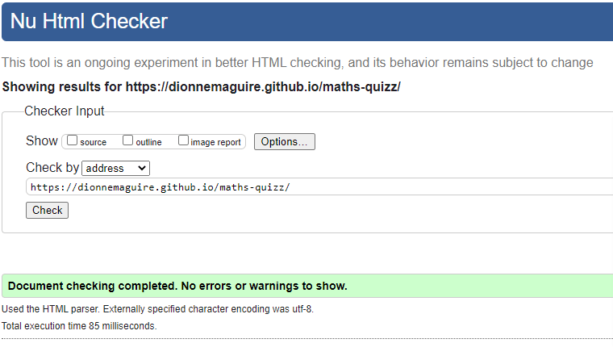
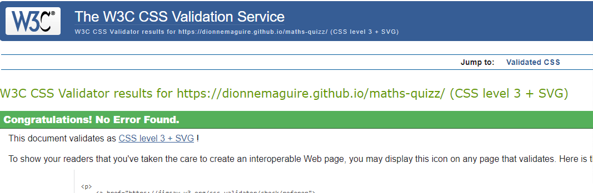
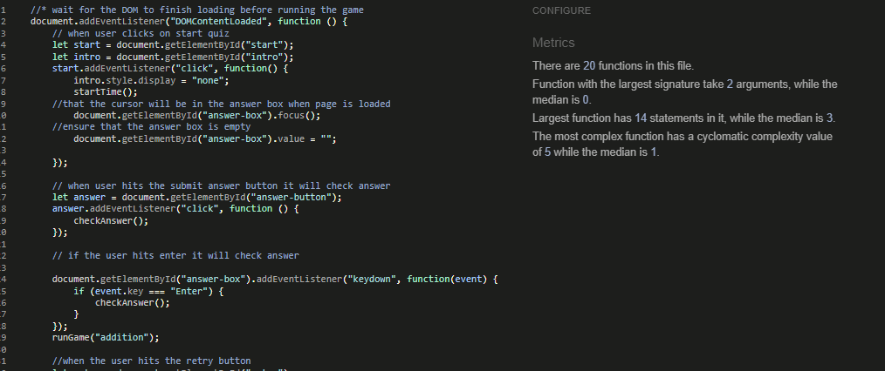
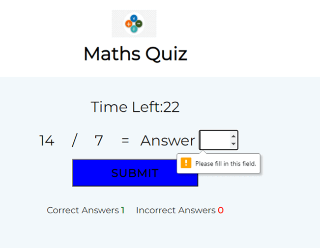

# Maths Quiz

This is a maths quiz, for anyone over the age of nine as there is addition, subtraction, multiplication and division questions.  The challenge is to answer the most correct answers within the time of 30 seconds. The user can retake the quiz over and over to improve their mathematic skills!  This is a useful for people of all ages to improve their mental arithmetic. The numbers that are used in each question are randomly choosen and the operator is also randomly choosen.  So each quiz is different.

## Features

### Title and logo

I have used a very simple logo that shows the 4 operators (+, -, x, ÷)that are used in the quiz and a simple title of 'Maths Quiz'. I have added an alt attribute to the logo for screen readers.  I also used a very simple favicon of MQ with red background and black text.

### Introduction page

The first screen the user sees is the introduction modal. This very simple asks the user 'How many questions can you answer in 30 seconds?'.  There is a button to press to start the quiz.  Again very simple and easy for the user.  I have added that the button color goes from pale blue to dark blue when the user hovers over the button.  I have used a red background and black text so that it is bold and easy to read.

### Game Area

I have kept the game screen very simple.  The logo and title are at the top.  There is a countdown timer so that the user can see how much time is left.  There is a question area that displays the question and an answer box for the user to enter the answer.  I have labelled my answer box with answer for any screen readers. There is a submit answer button for the user to click when they have entered their answer.  The user can also use the enter key to submit their answers.  I have added code so that the answer box is cleared after each question so that the user does not have to clear it before answering the next question.  Also I have set the cursor to be in the answer box to again make it easier for the user. At the bottom I have the number of correct answers and the number of incorrect answers, these figures are updated after each question has been answered.
Again the submit button changes to a darker color when the  mouse is hovering over it.

### Result Page

When the timer reaches zero the results page shows with how many correct answers and how many incorrect answers the user has achieved in the 30 seconds. I have the number of correct answers and incorrect answers in a differnet color so that it is easy to read for the user. There is a 'Try again' button that the user can press to retake the quiz.  As with the other buttons the color darkens when the users mouse hovers over the button.

### Future features

- A future feature would be to get the user to input their name before beginning the quiz and then I could personalise the results page with Well Done Bob! You got....
- Also I had planned to show a green tick icon if the user got the correct answer and a red x if they got the incorrect answer but I ran out of time.

## Testing

### Validator Testing

- No errors were returned when code passed through W3C Validator for HTML.

- No errors were returned when code passed through W3C Validator for css.

- No errors were returned when code passed through JSHint for javascript.

- Accessibility - I ran it through lighthouse in devtools and got the following results:

### Manual Testing

- I tested by clicking the start quiz, the user is brought onto the main question area.
- I tested you cannot enter anything else other than a number, as the answer box has a type=number. 
- I tested that a warning "Please fill in this field" comes up on the answer box.

- I tested that you can submit an answer with either the submit button or the enter key.
- I tested that when the timer goes to zero the results modal is shown with the amount of correct answers and number of incorrect answers.
- I tested that when the Try again button is pressed the user is brought back to the intro screen to start the quiz again.
- I tested all the above on the development site and the fully deployed site.
- I tested that my website worked on different browsers - Google Chrome, Safari, Microsoft Edge, Mozilla Firefox.
- I tested that my website is responsive, looks good and functions on all standard screen sizes using devtools.
- I have also manually tested on a number of different devices - android phone, iphone, ipad, mini ipad.

### Bugs and fixes

- Initially my timer was counting down and not stopping at zero.  I added the clearInterval function to fix this issue.
- When a user had put a number in the answer box but had not hit enter or submit button the answer box was not being cleared so when the next game began there was a number already in the answer box.  I added code to clear the answer box at the beginning of each game.
- I am getting an intermittent problem, whereby when the user enters their answer sometimes it adds 1 to both correct and incorrect answers.  The code i have changed in the interim should not have affected this.  I have removed the code I have changed and tried again and still the problem persists.  Then I try later and it seems to be working again.  This makes it so difficult to track.

## Deployment

This site was deployed to GitHub pages. The steps to deploy are as follows:

1. Open repository in GitHub

2. Click settings and scroll down to GitHub pages

3. At GitHub pages

4. Here click on none and scroll down and select main

5. Click save

6. The page then displays the path that my site is published on

- The live link can be found here - https://dionnemaguire.github.io/maths-quizz/

### Forking the GitHub Repository

Forking the GitHub Repository, so that you can make changes without affecting the original code can be done as follows:

1. Log into your GitHub account

2. Navigate to the repository yu are wanting to fork

3. in the upper right of the repository, click the 'Fork' button

4. A copy of the repository will now be available within your repositoies

### Cloning the Project

To make a local clone of the project can be done as follows:

1. Log into your GitHub account

2. Navigate to the Repository

3. In the upper section of the repository click the dropdown menu named 'Code'

4. Click on the clipboard icon to copy the URL

5. Open GitBash in your IDE

6. Change the current working directory to the location you want to place the clone

7. Type git clone and paste the copied URL

8. Press enter for the clone to be created

## Credits
- I used Love Maths walk through project to help me structure my quiz.
- I used google fonts for Montserrat.
- I applied getting a random number to then get a random operator for each question.
- I used educative.io to understand timers as well as W3Schools.
- I used W3Schools for the modal screens as well as some youtube videos.
- I used https://ciaraosull.github.io/project-2-whack-a-mole/index.html to help understand modals and timers.
- I used slack to understand and code the timer.
- I used cork-swap/README to complete the forking and cloning in the deployment section.
- I used cloud converter to convert my images from png to webp.
- I used tinyPNG to compress all images.
- I got great help and tips from my msletb-nov-2021 chort, our facilitator and my mentor Okwudiri Okoro. 
